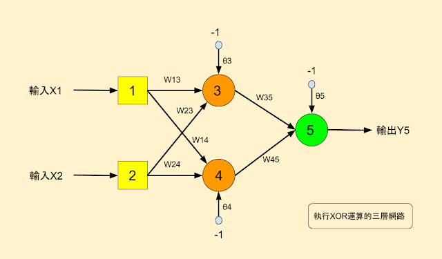

# Neural Network backpropagation

## XOR邏輯運算 ##

> - input.txt 裡有2個輸入(X1、X2)及1個預期結果(Y5)(共4筆)
> - weight and bias 皆為 亂數給予
> - activation function 採用  Sigoid function
> - learning rate 設為0.5
> - forward函式為激勵：計算隱含層、輸出層實際輸出
> - backward函式為訓練權重：更新隱含層、輸出層神經元的權重
> - epoch:重複forward & backward直到滿足|outputErr = 期望值 - 實際值|<0.01
> - 結果輸出：input.txt檔案讀入之輸入做XOR，並顯示期望值、實際值以及兩者誤差，還有計算epoch次數

## How to use
輸入指令執行
> 1. cd src
> 2. make
> 3. ./BP

[參考資料1](http://arbu00.blogspot.tw/2016/11/2-pythonbackprogation-artificial.html) 
[參考資料2](https://mattmazur.com/2015/03/17/a-step-by-step-backpropagation-example/) 
